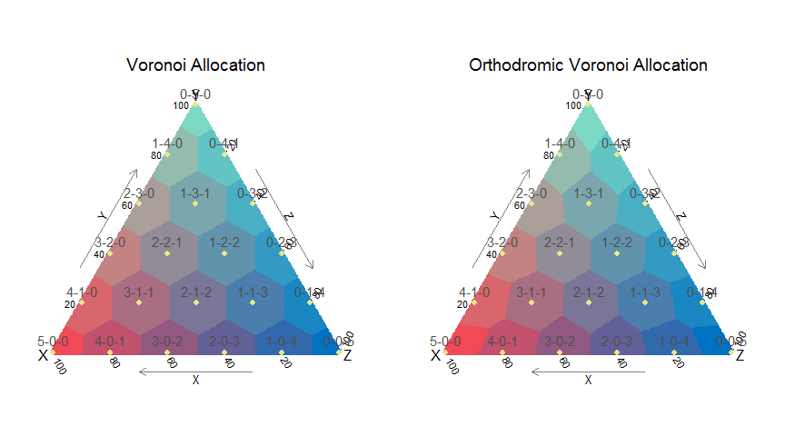
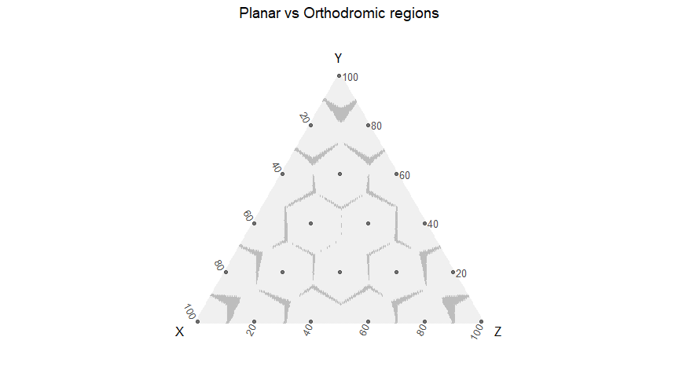
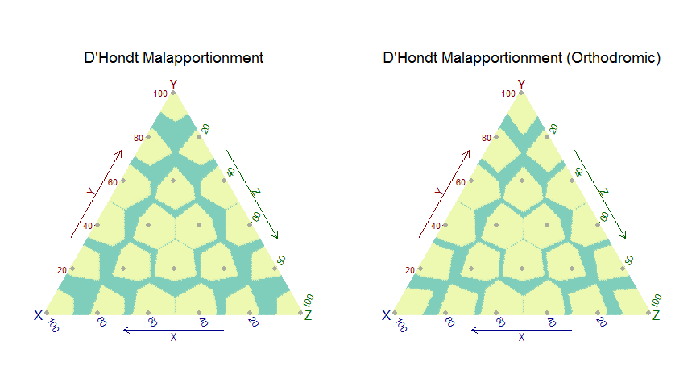
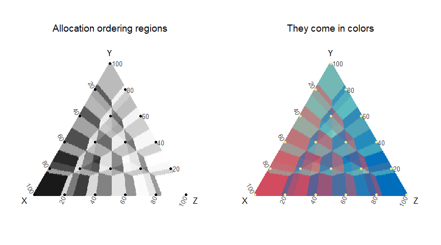
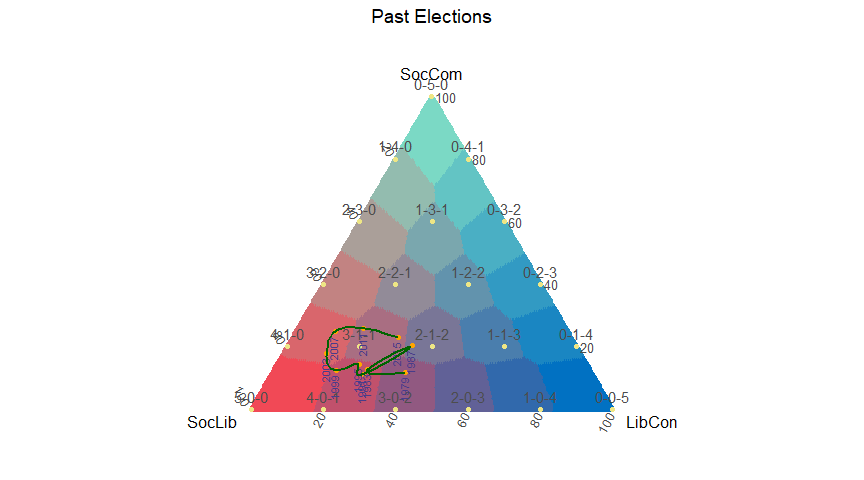
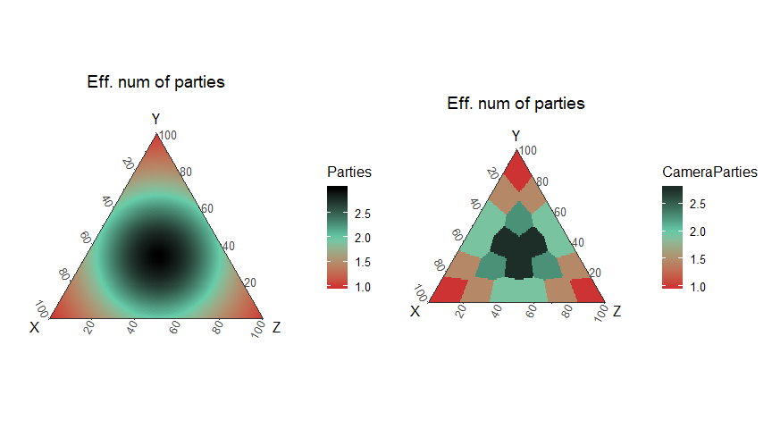
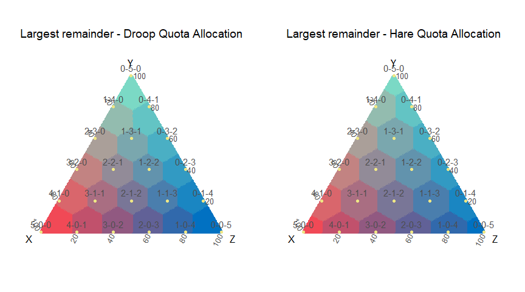
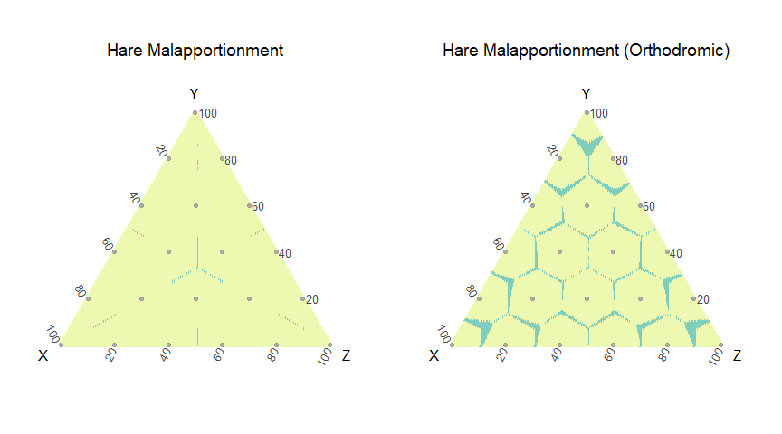

# A Tomography of Electoral Methods

## Geometric visualization for proportional electoral methods.

Code available here: <https://github.com/ismaelsb/ElectoralSpace>
 
Interactive web app: <https://ismaelsb.shinyapps.io/ElectoralSpace>


**Drawing the electoral regions**

When talking about the electoral system and electoral reforms there is mainly two kinds of systems: the majoritarian and the proportional systems. In majoritarian electoral systems only a candidate and party is represented in each district. This leaves minority parties, or parties whose voters are not concentrated in a territory, unrepresented. Proportional systems though tend to concede representation to more parties. In any of the cases, electoral methods don't belong to a pure kind, so there is a continuum of shades and people often complain about the porportionality of the systems and demand 'one person, one vote'. They may be wanting equality in the value of their votes and they usually want this to get achieved by allocating seats to territories by their population. There are always problems with the numbers of seats allocated to the less populated territories. But there is an even more important and complex problem: the ability of the system to represent minority parties, primarily when their voters are dispersed. This can be solved if all districts in the elections have a considerable number of seats, for if we have districts with a few seats, there is no way without wasting the votes of lesser parties.

Knowing all this we can still do a little engineering with the mathematical method for the partitions of seats. The choose of a method can be blamed for the overall unfairness of the electoral system, but don't let us tarnish the memory of Victor d'Hondt for the illness of the whole system. At this point let's wonder how a fair discrete partition method should be. It must be an axiom that for each sharing of votes identical to the proportions of a discrete (integer) partition summing the total number of seats, this discrete partition should be allocated. Moreover, I say the proportion of seats allocated to each party and the proportion of votes to each party in the districts must be as close as possible.

Let's figure out a 'drawing' technique for electoral methods. We are restricted to two dimesions (on a paper or a screen). If we draw all the posible outcomes of an election with only two parties we can colour the zones in which the configuration of the partition of the seats is the same, with the same colour, from, say, red to blue, passing through the intermediate shades. Soon we notice that proportional outcomes give the same allocation of seats, so we don't need to paint all the points, just a line segment, from 0% to 100% of the votes obtained by one of the parties. Drawing a line won't give us plenty of information, and we still have one dimension left. We can try to plot the results for three parties, one point for each set of proportional electoral outcomes. Thus we get a ternary diagram representing the projective space for the positive quadrant of the tridimensional space, this is the so called 3-simplex and the barycentric coordinates. If we color the regions of electoral results by its closeness to a seat allocation node, it should be something like this:


   

For four parties we'd need a tetrahedron. The diagram is usefull for visualizing possible seats at stake when the results are close to the borders between two or more regions.

We have used different types of distances for the measure of the 'closeness'. Different distances can produce different Voronoi regions: those created by distances on the projective space of the simplex (Euclidean, Manhattan and Uniform) give the same regions (first diagram), and those created by the orthodromic distance on the unit sphere (normalized vectors) give the regions of the second diagram.

Voronoi regions would be obtained by a method always allocating the nearest node. A Voronoi allocation method should solve the ties between two or more parties when the result is in a border in the same way the quotients methods do (by the total number of votes, and if the tie persists, at random).


```
## [1] 1
```

```
## [1] 1
```

```
## [1] 1
```

```
## [1] 0.9146269
```


**Highest averages methods**

Now is when we wonder if the well known D'Hondt method somehow resembles our goal. This method of sharing seems pretty straightforward and natural when is firstly explained to us, but this is why it got a bad reputation:


  

```
## [1] 0.3691045
```

```
## [1] 0.2856219
```

The diagram for malaportionment shows the proportion of results not allocated to the nearest node.

The border between two adjacent allocation regions R1 and R2 in the Electoral Space (simplex Σxi=1, 0≤xi≤1) for p parties and s seats, with allocation S1=(s11, ... , s1p) and S2=(s21, ... , s2p), Σs1k=Σs2k=S, dManhattan(S1,S2)=2, s1i≠s2i and s1j≠s2j for i≠j, is given by the hyperplane a•xi-b•xj=0 with a=max(s1j,s2j) and b=max(s1i,s2i).

Another way of wronging the lesser parties is by setting an artificial entry threshold above the effective threshold of the method:

 

Clearly, this method shows a bias towards extreme nodes. Again, we shouldn't blame highest averages methods for this. Luckily Sainte-Laguë came to help us:

  

```
## [1] 0.08014925
```

```
## [1] 0.08333333
```

 

This is getting close. Still those shapes...

The regions created by D'Hondt method aren't the same as the Voronoi regions created by the lattice of nodes. This method allocates more than 60% of the points correctly whereas Sainte-Laguë method is, in more than 90% of the points, similar to Voronoi. In D'Hondt the sizes of the regions are similar, but Sainte-Laguë produces regions centered on the nodes.

Highest averages methods produce regions with borders in angular sections. Voronoi borders are given by segment sections.

We study here not only the result of allocation, but also the ordering in the allocation of seats, and so we plot a diagram for the regions of different allocation orderings in the Electoral Space as subregions of the allocation ones. This diagram visualizes in a remarkable way the geometry of the Electoral Space:

 

Let's see some diagrams for different number of seats:

 

We can plot the history of elections in one diagram:


 

**Diversity measures: entropy and effective number of parties**

The diagrams below show vote disperion and camera dispersion measured with different diversity indexes: Shannon entropy and Laakso-Taagepera effective number of parties.

  

**Largest remainder methods**

Highest average methods give an answer to those who pursue different levels of proportionality. Bias effects can be corrected or reinforced in any direction. But electors still seem to mistrust the quotients in the Highest averages algorithm. When they say 'one person, one vote', one must struggle to get inside their minds and finally notice that they feel comfortable with the simple division. Then total votes divided somehow by the total seats is the quota. And what's with the rests? This is when the largest remainder methods come:


  

```
## [1] 0.004925373
```

```
## [1] 0.08835821
```

So largest remainder method with Hare Quota is similar to Voronoi allocation. Hare quota gives the nearest allocation to each share of votes. Its allocation regions are the Voronoi regions given by the seat allocation nodes. Differences are only observed in the boundaries because we have not considered the way ties break when using the distance functions.

Then there are interests in biasing the results towards the greatest parties, and that's why Droop-Hagenbach–Bischoff method exists.

Hare quota is pretty close to Sainte-Laguë and Droop quota is so to D'Hondt, as can be seen in the next diagrams:

 

```
## [1] 0.8931343
```

```
## [1] 0.9232836
```

Finally let's take a look at the numbers. Here is an example of allocation:


```r
#Allocation example (step=2 Sainte-Laguë; step=1 D'Hondt)
votes <- sample(1:1000, 3) 
votes
```

```
## [1]  77 265 117
```

```r
#alloc(letters[1:3], votes, seats=5, step=1)
#alloc(letters[1:3], votes, seats=c(3,5,4), step=2:1, threshold=0.5)
alloc(letters[1:3], votes, 9, c(1,2), .05) #print seats sum and allocation
```

```
## [[1]]
## [[1]]$`divisor step 1 for 9 seats`
## 
## a b c 
## 1 6 2 
## 
## [[1]]$`ordering for divisor step 1 for 9 seats`
##       [,1]
##  [1,] "b" 
##  [2,] "b" 
##  [3,] "c" 
##  [4,] "b" 
##  [5,] "a" 
##  [6,] "b" 
##  [7,] "c" 
##  [8,] "b" 
##  [9,] "b" 
## 
## 
## [[2]]
## [[2]]$`divisor step 2 for 9 seats`
## 
## a b c 
## 2 5 2 
## 
## [[2]]$`ordering for divisor step 2 for 9 seats`
##       [,1]
##  [1,] "b" 
##  [2,] "c" 
##  [3,] "b" 
##  [4,] "a" 
##  [5,] "b" 
##  [6,] "c" 
##  [7,] "b" 
##  [8,] "b" 
##  [9,] "a"
```

Sample of the data:


```r
#dots <- (dotsperside+1)*(dotsperside+2)/2

#df = SpatialData(dotsperside, seats, step)
#df = SpatialData(dotsperside, 5, 1, threshold)
#df = SpatialData(dotsperside, c(3,5,4), c(2,1), threshold)
#dfT = SpatialData(dotsperside, seats=5, threshold=.20)

head(df[[1]][sample(1:dots,10,replace=F),]) #sample data for step=1 and seats=5
```

```
##                x          y          z Sx Sy Sz Euclid Manhattan Uniform
## 14193 0.45728643 0.43718593 0.10552764  3  2  0     14        14      14
## 11800 0.35678392 0.42211055 0.22110553  2  2  1     14        14      14
## 6773  0.18592965 0.19095477 0.62311558  1  1  3      8         8       8
## 9930  0.28643216 0.62814070 0.08542714  1  4  0     15        15      15
## 2176  0.05527638 0.15075377 0.79396985  0  0  5      2         2       2
## 18466 0.71859296 0.09045226 0.19095477  4  0  1     19        19      19
##       Orthodromic Malapportionment Malapportionment2 AllocOrderCode All2
## 14193          14             TRUE              TRUE             30    5
## 11800          14            FALSE             FALSE             46    5
## 6773            8            FALSE             FALSE             53    1
## 9930           15             TRUE              TRUE            112    3
## 2176            2             TRUE              TRUE            242    1
## 18466          19            FALSE             FALSE             54    6
##       All3 All4 Allocated   Entropy CameraEntropy  Parties CameraParties
## 14193    9   12        18 0.9568365     0.6730117 2.430851      1.923077
## 11800    6    8        14 1.0654494     1.0549202 2.821991      2.777778
## 6773     1    2         8 0.9237212     0.9502705 2.177195      2.272727
## 9930     7    9        11 0.8603512     0.5004024 2.066534      1.470588
## 2176     1    1         1 0.6284667     0.0000000 1.523995      1.000000
## 18466   10   13        19 0.7709845     0.5004024 1.782464      1.470588
##       Droop
## 14193    18
## 11800    14
## 6773      8
## 9930     11
## 2176      2
## 18466    19
```

Effective threshold for representation:

D'Hondt method, s seats, p parties, σ:Pᵖ(Q)⁺→Nₛᵖ

Minima for representation:

Min sufficient: inf{β|πᵢ(v)>β⇒σᵢ(v)>0}=1/(s+1)

Max necessary:  sup{β|πᵢ(v)<β⇒σᵢ(v)=0}= 1/(s+p-1)

