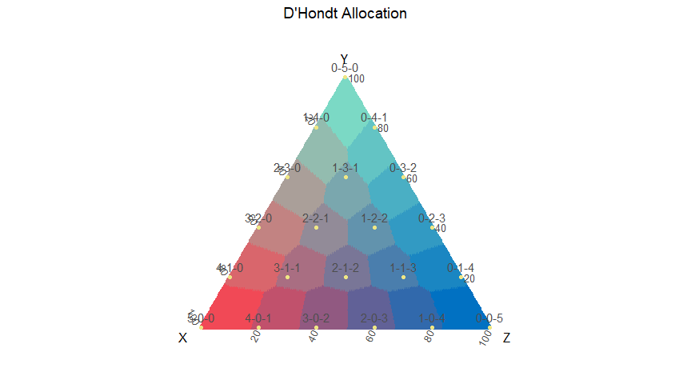
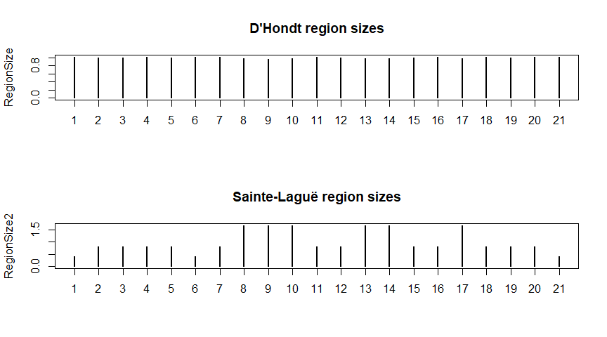
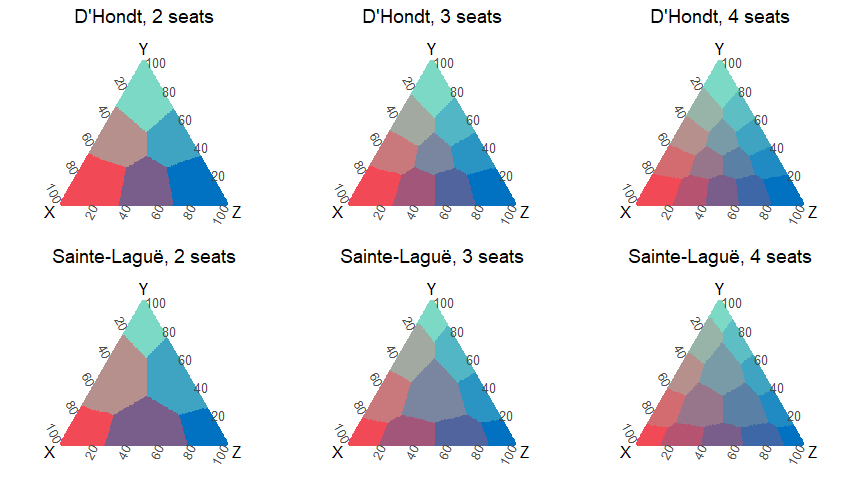

# Electoral Space

## Geometric visualization for proportional electoral methodes.

Code available here: <https://github.com/ismaelsb/ElectoralSpace>
 
Interactive web app: <https://ismaelsb.shinyapps.io/ElectoralSpace>

**Introduction**

In order to represent 3 variables in 2 dimensions in an only way for each set of proportional values, we can use a ternary diagram. You can see this diagram as the projection of the points from the positive quadrant in space onto the hyperplane of points whose sum of coodinates equals 1. The image of this projection is an equilateral triangle. In the same way we can represent two values in a segment and four values in a tetrahedron. This representation is also known by the name of barycentric coordinates in a simplex.


 


**Electoral allocation functions (more in the code)**

A diagram like these can be used to represent the results in political elections in which the votes are shared between 3 parties. Each point in the triangle is represented by three coordinates corresponding the share of votes received by each party. We have a determined number of seats to allocate, and each posible sharing is represented by a highlighted dot (a node) in the triangle and a label with its result. The electoral method would allocate to each electoral result one of the possible sharings of seats. The regions of points to which the same sharing is allocated are represented in the same color. For two parties we'd use a segment. For four, a tetrahedron. The diagram is usefull for visualizing possible seats at stake when the results are close to the borders between two or more regions.

We use a function for electoral allocation for different proportional methods and an optional entry threshold.

We also show some of the functions used to compute allocations or to plot the diagrams.


```r
generateColors <- function (colorRGB, seats) {
  
  nnodes = (seats+1)*(seats+2)/2;
  nodes <- as.matrix(generateNodes(seats)[,c("x","y","z")])
  #decimal codes for colors in nodes
  Code3 = floor(nodes*255.9/seats) #255.9 avoids seats -> 256 -> HEX #100 case
  #linear transformation to fixed extreme colors
  CodeDecRGB = floor(Code3%*%matrix(colorRGB,3,3, byrow=T)/256)
  #hex codes for colors in nodes
  CodeRGB=cbind(matrix("#",nnodes),format(as.hexmode(CodeDecRGB[,1]),width=2),format(as.hexmode(CodeDecRGB[,2]),width=2),format(as.hexmode(CodeDecRGB[,3]),width=2))
  CodeRGB=do.call("paste0",as.data.frame(CodeRGB))
  values=CodeRGB
  
  return(values);
  
}
```


 


```r
alloc <- function(parties, votes, seats, step, threshold=0){
  
  #function for the seat allocation and its ordering
  #computes allocation for several values of seats and divisor step methods
  #with the same quotiens table
  votes=votes*(votes>=(threshold*sum(votes)))
  Mst <- max(step)
  Mse <- max(seats)
  nquotients=(1+Mst*(Mse-1))
  
  #table with all the quotients needed
  quotienstable <- data.frame( 
    parties    = rep(parties, each = nquotients), 
    quotients  = as.vector(sapply(votes, function(x) 
      x/seq(from=1, to=nquotients) )),
    votesrep   = rep(votes, each = nquotients)
  ) 
  
  SeatsList=list()
  filteredtable =list()
  
  
  for (j in 1:length(step)) {
    
    
    #select from the table of all quotiens the ones whose divisors
    #belong to the current sequence, given 'seats' and 'step'
    select <- rep(seq(from=1, to=1+step[j]*(Mse-1), by=step[j]),length(parties))+
      rep(seq(from=0,to=nquotients*length(parties)-1,by=nquotients),each=Mse)
    
    filteredtable [[j]] <- quotienstable$parties[select][order(-quotienstable$quotients[select], -quotienstable$votesrep[select])]
    
    SeatsList[[j]]<-list()
    
    #a vector of values for seats if you want to compute the partial sums
    for (i in 1:length(seats)){
      SeatsList[[j]][[i]]= table(filteredtable[[j]][1:seats[i]])
    }
    
    names(SeatsList[[j]])[1:length(seats)]<-do.call("paste0",as.data.frame(cbind("divisor step ",step[j]," for ", seats," seats")))
    
    
    SeatsList[[j]][[length(seats)+1]] = as.matrix(filteredtable[[j]][1:Mse]) #ordering
    
    names(SeatsList[[j]])[length(seats)+1]<-paste0("ordering for divisor step ", step[j]," for ", Mse," seats")
    
    
  }
  
  
  return(SeatsList);
  
}
```

**Examples of allocation**


```r
#Allocation example (step=2 Sainte-Laguë; step=1 D'Hondt)
votes <- sample(1:1000, 3) 
votes
```

```
## [1]  77 265 117
```

```r
#alloc(letters[1:3], votes, seats=5, step=1)
#alloc(letters[1:3], votes, seats=c(3,5,4), step=2:1, threshold=0.5)
alloc(letters[1:3], votes, 9, c(1,2), .05) #print seats sum and allocation
```

```
## [[1]]
## [[1]]$`divisor step 1 for 9 seats`
## 
## a b c 
## 1 6 2 
## 
## [[1]]$`ordering for divisor step 1 for 9 seats`
##       [,1]
##  [1,] "b" 
##  [2,] "b" 
##  [3,] "c" 
##  [4,] "b" 
##  [5,] "a" 
##  [6,] "b" 
##  [7,] "c" 
##  [8,] "b" 
##  [9,] "b" 
## 
## 
## [[2]]
## [[2]]$`divisor step 2 for 9 seats`
## 
## a b c 
## 2 5 2 
## 
## [[2]]$`ordering for divisor step 2 for 9 seats`
##       [,1]
##  [1,] "b" 
##  [2,] "c" 
##  [3,] "b" 
##  [4,] "a" 
##  [5,] "b" 
##  [6,] "c" 
##  [7,] "b" 
##  [8,] "b" 
##  [9,] "a"
```


```r
generateDots <- function(dotsperside, method="lattice"){
  
  dots <- (dotsperside+1)*(dotsperside+2)/2
  
  if (method == "cartesian") {
    #Map Cartesian to Ternary to produce a homegeneous simulation
    Rc = matrix(runif(2*dots), nrow=dots, ncol=2)
    R  = matrix(apply(Rc,1, CartesianToTernary), nrow=dots, ncol=3, byrow=TRUE)
  }
  
  else if (method == "ternary") {
    #Ternary simulation. Projects points in[0,1]^3 to the sum(x)=1 hyperplane
    #This creates way more points in the center than in the extremes
    R = matrix(runif(3*dots), nrow=dots, ncol=3)
    R = prop.table(R,1) #rows sum 1
  }
  
  else if (method == "lattice") {
    #lattice of dots
    
    #read this if you want to use dots instead of dotsperside as input variable:
    #if n is dotsperside
    #dots <- (n+1)*(n+2)/2  
    #inverse calculation:
    #n <- floor((sqrt(8*dots+1)-3)/2) #exact
    #n <- floor(sqrt(2*dots)) #aprox
    
    #then redefine number of dots
    #dots <- (n+1)*(n+2)/2
    R <- matrix(0,nrow=dots, ncol=3)
    i <- 1
    for (x in 0:dotsperside){
      
      for (y in 0:(dotsperside-x)){
        
        R[i,]<- c(x,y,dotsperside-x-y)
        i <- i+1
        
      }
    }
    R = prop.table(R,1) #rows sum 1
  }
  
  return(R);
  
}
```


```r
ManhattanNearest <- function (x, seats, nodes, nnodes) {
  
  Manhattan = which.min(apply(abs(nodes/seats - rep(1,nnodes) %*% t(x)),1,sum))
  
  return(Manhattan);
  
}
```


```r
OrthodromicNearest <- function (x, seats, nodes, nnodes) {
  
  normnodes <- normalizenodes(nodes)
  Orthodromic = which.min(acos((x/norm(t(x),"F")) %*% t(as.matrix(normnodes))))
  
  return(Orthodromic);
  
}
```


**Data frame (more in the code)**


```r
SpatialData <- function (dotsperside, seats, step=1, threshold=0, method="lattice") {
  
  
  #Generate random electoral results
  R <- generateDots(dotsperside, method=method)
  dots=dim(R)[1]  #dots <- (dotsperside+1)*(dotsperside+2)/2
  
  Seats=max(seats)
  
  #nodes
  nodes  <- as.matrix(generateNodes(Seats)[,c("x","y","z")])
  nnodes <- (Seats+1)*(Seats+2)/2;
  
  #Indexes for Voronoi regions
  Uniform   = apply(R, 1, UniformNearest,   seats=Seats, nodes = nodes, nnodes=nnodes)
  Manhattan = apply(R, 1, ManhattanNearest, seats=Seats, nodes = nodes, nnodes=nnodes)
  Euclid    = apply(R, 1, EuclidNearest,    seats=Seats, nodes = nodes, nnodes=nnodes)
  Orthodromic=apply(R, 1, OrthodromicNearest,seats=Seats,nodes = nodes, nnodes=nnodes)
  
  
  #allocate seats
  AllocStructure <- apply(R, 1, function(x) alloc(as.character(1:3), x, seats, step, threshold))
  #input a vector of values for seats of to compute partial sums
  
  df=list() #list of dataframes, one for each 'step' value
  
  #loop for diferent 'step's
  for (j in 1:length(step)){
    
    #allocation
    AllocPartial=matrix(0,dots,length(seats))
    
    for (i in 1:length(seats)){
      
      S = t(matrix(sapply(AllocStructure, function(x) x[[j]][[i]]),nrow=3,ncol=dots))
      
      nodes_sub <- as.matrix(generateNodes(seats[i])[,c("x","y","z")])
      
      AllocPartial[,i] = apply(S, 1, AllocatedNode, nodes=nodes_sub, nnodes=(seats[i]+1)*(seats[i]+2)/2)
      
    }
    
    #allocation order
    #computes allocation ordering for max(seats) in each step value
    AllocOrder = t(matrix(sapply(AllocStructure, function(x) as.integer(x[[j]][[length(seats)+1]])),nrow=Seats,ncol=dots))
    vectorOrderCode=as.matrix(3^(0:(Seats-1)))
    #this coding highlights the last seats over the first ones
    # so that there is contrast between adjacent regions
    AllocOrderCode = (matrix(AllocOrder, ncol=Seats)-1) %*% as.matrix(vectorOrderCode)
    
    dfPartial=as.data.frame(AllocPartial)
    names(dfPartial) <- do.call(paste0,as.data.frame(cbind("All",seats)))
    names(dfPartial)[which(seats==Seats)] <- "Allocated"
    
    #assembling a data frame
    df0 = data.frame(
      
      
      x             = as.matrix(R[,1]),
      y             = as.matrix(R[,2]),
      z             = as.matrix(R[,3]),
      
      Sx            = S[,1],
      Sy            = S[,2],
      Sz            = S[,3],
      
      Euclid,
      Manhattan,
      Uniform,
      Orthodromic,
      
      Malapportionment = AllocPartial[1:dots,length(seats)] != Euclid[1:dots],
      Malapportionment2 = AllocPartial[1:dots,length(seats)] != Orthodromic[1:dots],
      
      AllocOrderCode
      
      
    )
    
    df0=cbind(df0,dfPartial)
    
    df[[j]]<-df0
    
  } #end of loop for different 'step's
  
  
  return(df);
  
}
```

**Settings**


```r
#presets
seats=2:5;
step=c(1,2); #(2 Sainte-Laguë 1 D'Hondt)
dotsperside=199 #dots <- (dotsperside+1)*(dotsperside+2)/2
threshold=0
```

**Generating the data**


```r
#Spatial data

dots <- (dotsperside+1)*(dotsperside+2)/2

df = SpatialData(dotsperside, seats, step)

#df = SpatialData(dotsperside, 5, 1, threshold)

#df = SpatialData(dotsperside, c(3,5,4), c(2,1), threshold)

dfT = SpatialData(dotsperside, seats=5, threshold=.20)


head(df[[1]][sample(1:dots,10,replace=F),]) #sample data for step=1 and seats=5
```

```
##                x          y          z Sx Sy Sz Euclid Manhattan Uniform
## 14193 0.45728643 0.43718593 0.10552764  3  2  0     14        14      14
## 11800 0.35678392 0.42211055 0.22110553  2  2  1     14        14      14
## 6773  0.18592965 0.19095477 0.62311558  1  1  3      8         8       8
## 9930  0.28643216 0.62814070 0.08542714  1  4  0     15        15      15
## 2176  0.05527638 0.15075377 0.79396985  0  0  5      2         2       2
## 18466 0.71859296 0.09045226 0.19095477  4  0  1     19        19      19
##       Orthodromic Malapportionment Malapportionment2 AllocOrderCode All2
## 14193          14             TRUE              TRUE             30    5
## 11800          14            FALSE             FALSE             46    5
## 6773            8            FALSE             FALSE             53    1
## 9930           15             TRUE              TRUE            112    3
## 2176            2             TRUE              TRUE            242    1
## 18466          19            FALSE             FALSE             54    6
##       All3 All4 Allocated
## 14193    9   12        18
## 11800    6    8        14
## 6773     1    2         8
## 9930     7    9        11
## 2176     1    1         1
## 18466   10   13        19
```

**Electoral Space regions**

The regions created by D'Hondt method aren't the same as the Voronoi regions created by the lattice of nodes. This method allocates more than 60% of the points correctly whereas Sainte-Laguë method is, in more than 90% of the points, similar to Voronoi. In D'Hondt the sizes of the regions are similar, but Sainte-Laguë produces regions centered on the nodes. Voronoi regions would be obtained by a method always allocating the nearest node. Those regions are similar if we use Euclidean, Manhattan or uniform distance. A Voronoi allocation method should solve the ties between two or more parties when the result is in a border in the same way the quotients methods do (by the total number of votes, and if the tie persists, at random).

Quotients method produce regions with borders in angular sections. Voronoi borders are given by segment sections.

We study here not only the result of allocation, but also the ordering in the allocation, and so we plot a diagram for the regions of different allocation orderings in the Electoral Space as subregions of the allocation ones.
This diagram visualizes in a remarkable way the geometry of the Electoral Space.


```r
#Allocation

a1 <- ggtern(data=df[[1]],aes(x,y,z,color=as.factor(Allocated)))+
  theme_bw()+
  geom_point(alpha=1)+
  geom_point(data=NodesData,aes(x,y,z),color="khaki2")+
  geom_text(data=NodesData,aes(label=label), color="grey30", hjust=0.5, vjust=-0.6, size=4)+ 
  labs(x="X",y="Y",z="Z",title="D'Hondt Allocation")+
  #scale_colour_grey(start = 0.4, end = 1, na.value = "black", guide = FALSE)
  scale_colour_manual(values=generateColors(colorRGB0,max(seats)), guide=FALSE, na.value="khaki2")

a2 <- ggtern(data=df[[2]],aes(x,y,z,color=as.factor(Allocated)))+
  theme_bw()+
  geom_point(alpha=1)+
  geom_point(data=NodesData,aes(x,y,z),color="khaki2")+
  geom_text(data=NodesData,aes(label=label), color="grey30", hjust=0.5, vjust=-0.6, size=4)+ 
  labs(x="X",y="Y",z="Z",title="Sainte-Laguë Allocation")+
  #scale_colour_grey(start = 0.4, end = 1, na.value = "black", guide = FALSE)
  scale_colour_manual(values=generateColors(colorRGB0,max(seats)), guide=FALSE, na.value="khaki2")

ggtern.multi(a1, a2, cols=2)
```

 

  

**Comparing Voronoi regions over different metrics**

Euclid, Manhattan and Uniform distances produce exactly the same Voronoi regions. Orthodromic distance on the unit sphere produces different regions:


```
## [1] 1
```

```
## [1] 1
```

```
## [1] 1
```

```
## [1] 0.9146269
```

 

**Size of the regions**

 

**Proportion of results not allocated to the nearest node**

  

```
## [1] 0.3691045
```

```
## [1] 0.08014925
```

```
## [1] 0.2856219
```

```
## [1] 0.08333333
```

**Effect of a threshold on the regions**

 

**Regions for different orderings in the allocation**


 

**Partial sums in the allocation**

 

**History of elections**

We can also draw historic data from past elections on the diagrams.


```r
generateSpline <- function (dfvotes, method = "natural") {
  
  #generates a spline curve through elections history
  
  nelect = dim(dfvotes)[1]
  
  splineX <- spline(x=1:nelect,y=dfvotes$x, method=method)
  splineY <- spline(x=1:nelect,y=dfvotes$y, method=method)
  
  dfSpline = matrix(0, length(splineX[[1]]), 3)
  dfSpline[,1] <- splineX[[2]]
  dfSpline[,2] <- splineY[[2]]
  dfSpline[,3] <- 1-dfSpline[,1]-dfSpline[,2]
  dfSpline = as.data.frame(dfSpline)
  names(dfSpline) <- letters[24:26]
  
  return(dfSpline);
  
}
```


```r
ggtern(data=df[[1]],aes(x,y,z,color=as.factor(Allocated)))+
  #theme_rgbw()+
  theme_bw()+
  geom_point(alpha=1)+
  geom_point(data=NodesData,aes(x,y,z),color="khaki2")+
  geom_point(data=dfvotes,aes(x,y,z),color="orange",alpha=1)+
  geom_text(data=NodesData,aes(label=label), color="grey30", hjust=0.5, vjust=-0.6, size=4)+ 
  geom_text(data=dfvotes,aes(label=label), color="slateblue4", hjust=1.2, vjust=0.3, size=3, angle=90)+ 
  geom_path(data=dfSpline,colour="darkgreen", linetype=1, size=1)+ 
  #geom_path(data=dfvotes,colour="white", linetype=1, size=0.7)+ 
  labs(x="SocLib",y="SocCom",z="LibCon",title="Past Elections")+
  #scale_colour_grey(start = 0.4, end = 1, na.value = "black", guide = FALSE)
  scale_colour_manual(values=generateColors(colorRGB0,max(seats)), guide=FALSE, na.value="khaki2")
```

 

**Diversity measures: entropy and effective number of parties**

The diagrams below show vote disperion an camera dispersion measured with different diversity indexes: Shannon entropy and Laakso-Taagepera effective number of parties.

  

**Largest remainder method with Hare Quota is similar to Voronoi allocation**

Hare quota gives the nearest allocation to each share of votes. Its allocation regions are the Voronoi regions given by the seat allocation nodes:


```r
alloc <- function(parties, votes, seats, step=1, threshold=0){
  
  #function for Hare Quota seat allocation
  votes=votes*(votes>=(threshold*sum(votes)))
  
  nparties = length(votes)
  
  quota = sum(votes)/seats
  QAllocation = floor(votes/quota)
  rests = votes %% quota
  
  qtable <- data.frame(
    parties = 1:nparties,
    rests,
    votes
  )
  
  if (seats>sum(QAllocation)){
    
    largestRestsParties <- qtable[order(-rests,-votes),]$parties[1:(seats - sum(QAllocation))]
    largestRestsLogic <- is.element(1:nparties, largestRestsParties)
    
  } else {largestRestsLogic <- matrix(F,1,nparties)}
  
  
  Allocation = list(list(QAllocation + largestRestsLogic, matrix(parties[1],seats)))
  #ordering is not taken into account
  
  return(Allocation);
  
}
```

  

```
## [1] 0.004925373
```

```
## [1] 0.08835821
```

Differences are only observed in the boundaries because we have not considered the way ties break when using the distance functions.


Hare quota is pretty close to Sainte-Laguë and Droop quota is so to D'Hondt, as can be seen in the next diagrams.

 

```
## [1] 0.8931343
```

```
## [1] 0.9232836
```


