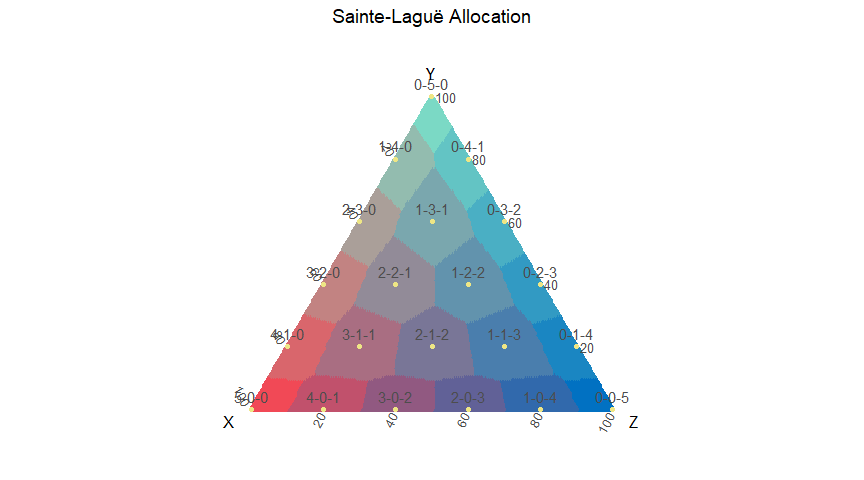

# Electoral Space

Código disponible en <https://github.com/ismaelsb/ElectoralSpace>
 


**Introducción**

Un diagrama ternario se utiliza para representar 3 variables en 2 dimensiones de forma única para cada conjunto de valores proporcionales. Se puede entender el diagrama como la proyección de los puntos del cuadrante positivo del espacio en
el hiperplano cuya suma de coordenadas es 1. La imagen de la proyección es un triángulo equilátero. De la misma manera podemos representar dos valores en un segmento o cuatro valores en un tetraedro.


 


**Funciones de asignación electoral (más en el código)**

Un diagrama como éste se puede usar para representar el resultado de unas elecciones en las que los votos se reparten entre 3 partidos. Cada punto del triángulo se representa con tres coordenadas que se corresponden con el porcentaje de voto obtenido por cada partido. Tenemos un número de escaños a repartir y cada posible reparto se representa con un punto resaltado (nodo) en el triángulo con su correspondiente resultado. El método electoral asignará a cada resultado electoral uno de los posibles repartos de escaños. Las regiones de puntos a las que le son asignados un mismo reparto serán representadas con un mismo color. Para dos partidos usaríamos un segmento y para cuatro, un tetraedro. El diagrama es útil para visualizar los posibles escaños en juego cuando el resultado está muy ajustado y próximo a la frontera entre dos o más regiones.

Utilizamos una función de asignación electoral para distintos métodos proporcionales de cocientes con la posibilidad de añadir un umbral de entrada. 

Mostramos algunas de las funciones utilizadas para calcular la asignación y generar los diagramas:


```r
generateColors <- function (colorRGB, seats) {
  
  nnodes = (seats+1)*(seats+2)/2;
  nodes <- as.matrix(generateNodes(seats)[,c("x","y","z")])
  #decimal codes for colors in nodes
  Code3 = floor(nodes*255.9/seats) #255.9 avoids seats -> 256 -> HEX #100 case
  #linear transformation to fixed extreme colors
  CodeDecRGB = floor(Code3%*%matrix(colorRGB,3,3, byrow=T)/256)
  #hex codes for colors in nodes
  CodeRGB=cbind(matrix("#",nnodes),format(as.hexmode(CodeDecRGB[,1]),width=2),format(as.hexmode(CodeDecRGB[,2]),width=2),format(as.hexmode(CodeDecRGB[,3]),width=2))
  CodeRGB=do.call("paste0",as.data.frame(CodeRGB))
  values=CodeRGB
  
  return(values);
  
}
```


 


```r
alloc <- function(parties, votes, seats, step, threshold=0){
  
  #function for the seat allocation and its ordering
  #computes allocation for several values of seats and divisor step methods
  #with the same quotiens table
  votes=votes*(votes>=(threshold*sum(votes)))
  Mst <- max(step)
  Mse <- max(seats)
  nquotients=(1+Mst*(Mse-1))
  
  #table with all the quotients needed
  quotienstable <- data.frame( 
    parties    = rep(parties, each = nquotients), 
    quotients  = as.vector(sapply(votes, function(x) 
      x/seq(from=1, to=nquotients) )),
    votesrep   = rep(votes, each = nquotients)
  ) 
  
  SeatsList=list()
  filteredtable =list()
  
  
  for (j in 1:length(step)) {
    
    
    #select from the table of all quotiens the ones whose divisors
    #belong to the current sequence, given 'seats' and 'step'
    select <- rep(seq(from=1, to=1+step[j]*(Mse-1), by=step[j]),length(parties))+
      rep(seq(from=0,to=nquotients*length(parties)-1,by=nquotients),each=Mse)
    
    filteredtable [[j]] <- quotienstable$parties[select][order(-quotienstable$quotients[select], -quotienstable$votesrep[select])]
    
    SeatsList[[j]]<-list()
    
    #a vector of values for seats if you want to compute the partial sums
    for (i in 1:length(seats)){
      SeatsList[[j]][[i]]= table(filteredtable[[j]][1:seats[i]])
    }
    
    names(SeatsList[[j]])[1:length(seats)]<-do.call("paste0",as.data.frame(cbind("divisor step ",step[j]," for ", seats," seats")))
    
    
    SeatsList[[j]][[length(seats)+1]] = as.matrix(filteredtable[[j]][1:Mse]) #ordering
    
    names(SeatsList[[j]])[length(seats)+1]<-paste0("ordering for divisor step ", step[j]," for ", Mse," seats")
    
    
  }
  
  
  return(SeatsList);
  
}
```

**Ejemplo de asignación**


```r
#Allocation example (step=2 Sainte-Laguë; step=1 D'Hondt)
votes <- sample(1:1000, 3) 
votes
```

```
## [1]  77 265 117
```

```r
#alloc(letters[1:3], votes, seats=5, step=1)
#alloc(letters[1:3], votes, seats=c(3,5,4), step=2:1, threshold=0.5)
alloc(letters[1:3], votes, 9, c(1,2), .05) #print seats sum and allocation
```

```
## [[1]]
## [[1]]$`divisor step 1 for 9 seats`
## 
## a b c 
## 1 6 2 
## 
## [[1]]$`ordering for divisor step 1 for 9 seats`
##       [,1]
##  [1,] "b" 
##  [2,] "b" 
##  [3,] "c" 
##  [4,] "b" 
##  [5,] "a" 
##  [6,] "b" 
##  [7,] "c" 
##  [8,] "b" 
##  [9,] "b" 
## 
## 
## [[2]]
## [[2]]$`divisor step 2 for 9 seats`
## 
## a b c 
## 2 5 2 
## 
## [[2]]$`ordering for divisor step 2 for 9 seats`
##       [,1]
##  [1,] "b" 
##  [2,] "c" 
##  [3,] "b" 
##  [4,] "a" 
##  [5,] "b" 
##  [6,] "c" 
##  [7,] "b" 
##  [8,] "b" 
##  [9,] "a"
```


```r
generateDots <- function(dotsperside, method="lattice"){
  
  dots <- (dotsperside+1)*(dotsperside+2)/2
  
  if (method == "cartesian") {
    #Map Cartesian to Ternary to produce a homegeneous simulation
    Rc = matrix(runif(2*dots), nrow=dots, ncol=2)
    R  = matrix(apply(Rc,1, CartesianToTernary), nrow=dots, ncol=3, byrow=TRUE)
  }
  
  else if (method == "ternary") {
    #Ternary simulation. Projects points in[0,1]^3 to the sum(x)=1 hyperplane
    #This creates way more points in the center than in the extremes
    R = matrix(runif(3*dots), nrow=dots, ncol=3)
    R = prop.table(R,1) #rows sum 1
  }
  
  else if (method == "lattice") {
    #lattice of dots
    #if n is dotsperside
    #dots <- (n+1)*(n+2)/2  but we need the inverse calculation
    
    #n <- floor((sqrt(8*dots+1)-3)/2) #exact
    #n <- floor(sqrt(2*dots)) #aprox
    
    #we need to redefine dots
    #dots <- (n+1)*(n+2)/2
    R <- matrix(0,nrow=dots, ncol=3)
    i <- 1
    for (x in seq(0,1,1/dotsperside)){
      
      for (y in seq(0,1-x,1/dotsperside)){
        
        R[i,]<- c(x,y,1-x-y)
        i <- i+1
        
      }
    }
    R = prop.table(R,1) #rows sum 1
  }
  
  return(R);
  
}
```


```r
ManhattanNearest <- function (x, seats, nodes, nnodes) {
  
  Manhattan = which.min(apply(abs(nodes/seats - rep(1,nnodes) %*% t(x)),1,sum))
  
  return(Manhattan);
  
}
```


**Matriz de datos (más en el código)**


```r
SpatialData <- function (dotsperside, seats, step=1, threshold=0, method="lattice") {
  
  
  #Generate random electoral results
  R <- generateDots(dotsperside, method=method)
  dots=dim(R)[1]  #dots <- (dotsperside+1)*(dotsperside+2)/2
  
  Seats=max(seats)
  
  #nodes
  nodes  <- as.matrix(generateNodes(Seats)[,c("x","y","z")])
  nnodes <- (Seats+1)*(Seats+2)/2;
  
  #Indexes for Voronoi regions
  Uniform   = apply(R, 1, UniformNearest,   seats=Seats, nodes = nodes, nnodes=nnodes)
  Manhattan = apply(R, 1, ManhattanNearest, seats=Seats, nodes = nodes, nnodes=nnodes)
  Euclid    = apply(R, 1, EuclidNearest,    seats=Seats, nodes = nodes, nnodes=nnodes)
  
  #allocate seats
  AllocStructure <- apply(R, 1, function(x) alloc(as.character(1:3), x, seats, step, threshold))
  #input a vector of values for seats of to compute partial sums
  
  df=list() #list of dataframes, one for each 'step' value
  
  #loop for diferent 'step's
  for (j in 1:length(step)){
    
    #allocation
    AllocPartial=matrix(0,dots,length(seats))
    
    for (i in 1:length(seats)){
      
      S = t(matrix(sapply(AllocStructure, function(x) x[[j]][[i]]),nrow=3,ncol=dots))
      
      nodes_sub <- as.matrix(generateNodes(seats[i])[,c("x","y","z")])
      
      AllocPartial[,i] = apply(S, 1, AllocatedNode, nodes=nodes_sub, nnodes=(seats[i]+1)*(seats[i]+2)/2)
      
    }
    
    #allocation order
    #computes allocation ordering for max(seats) in each step value
    AllocOrder = t(matrix(sapply(AllocStructure, function(x) as.integer(x[[j]][[length(seats)+1]])),nrow=Seats,ncol=dots))
    vectorOrderCode=as.matrix(3^(0:(Seats-1)))
    #this coding highlights the last seats over the first ones
    # so that there is contrast between adjacent regions
    AllocOrderCode = (matrix(AllocOrder, ncol=Seats)-1) %*% as.matrix(vectorOrderCode)
    
    dfPartial=as.data.frame(AllocPartial)
    names(dfPartial) <- do.call(paste0,as.data.frame(cbind("All",seats)))
    names(dfPartial)[which(seats==Seats)] <- "Allocated"
    
    #assembling a data frame
    df0 = data.frame(
      
      
      x             = as.matrix(R[,1]),
      y             = as.matrix(R[,2]),
      z             = as.matrix(R[,3]),
      
      Sx            = S[,1],
      Sy            = S[,2],
      Sz            = S[,3],
      
      Euclid,
      Manhattan,
      Uniform,
      
      Malapportionment = AllocPartial[1:dots,length(seats)] != Euclid[1:dots],
      
      AllocOrderCode
      
      
    )
    
    df0=cbind(df0,dfPartial)
    
    df[[j]]<-df0
    
  } #end of loop for different 'step's
  
  
  return(df);
  
}
```

**Configuración**


```r
#presets
seats=2:5;
step=c(1,2); #(2 Sainte-Laguë 1 D'Hondt)
dotsperside=200 #dots <- (dotsperside+1)*(dotsperside+2)/2
threshold=0
```

**Generando los datos**


```r
#Spatial data

dots <- (dotsperside+1)*(dotsperside+2)/2

df = SpatialData(dotsperside, seats, step)

#df = SpatialData(dotsperside, 5, 1, threshold)

#df = SpatialData(dotsperside, c(3,5,4), c(2,1), threshold)

dfT = SpatialData(dotsperside, seats=5, threshold=.20)


head(df[[1]][sample(1:dots,10,replace=F),]) #sample data for step=1 and seats=5
```

```
##           x     y     z Sx Sy Sz Euclid Manhattan Uniform Malapportionment
## 14335 0.460 0.140 0.400  3  0  2     13        13      13             TRUE
## 11918 0.360 0.005 0.635  2  0  3     12        12      12            FALSE
## 6841  0.185 0.345 0.470  1  2  2      9         9       9            FALSE
## 10029 0.290 0.115 0.595  1  0  4      8         8       8             TRUE
## 2198  0.055 0.205 0.740  0  1  4      2         2       2            FALSE
## 18651 0.720 0.010 0.270  4  0  1     19        19      19            FALSE
##       AllocOrderCode All2 All3 All4 Allocated
## 14335             60    4    8   10        16
## 11918             74    4    5    6        12
## 6841             104    2    2    7         9
## 10029            224    1    5    6         7
## 2198             215    1    1    2         2
## 18651             18    6    8   13        19
```

**Regiones del Espacio Electoral**

Las regiones creadas por el reparto de D'Hondt no se corresponden con regiones de Voronoi de los nodos. Asigna correctamente más del 60% de los puntos. El reparto de Sainte-Laguë se aproxima más, más de un 90%, a las regiones de Voronoi pero no llega a ser igual. En D'Hondt el tamaño de las distintas regiones es similar, en Sainte-Laguë los nodos se encuentran en el centro de ellas. Las regiones de Voronoi resultarían si a cada punto se le asignara el nodo más próximo. Para este tipo de reparto se obtienen los mismos resultados si utilizamos la distancia Euclídea, Manhattan o la uniforme.

Se estudia aquí la asignación no sólo en resultado, sino también en el orden de reparto de los escaños, y se dibujan diagramas que muestran las regiones del Espacio Electoral divididas en subregiones para cada posible ordenación de la asignación. El diagrama de las subregiones visibiliza de manera bastante destacable la geometría de las regiones electorales.


```r
#Allocation

a1 <- ggtern(data=df[[1]],aes(x,y,z,color=as.factor(Allocated)))+
  theme_bw()+
  geom_point(alpha=1)+
  geom_point(data=NodesData,aes(x,y,z),color="khaki2")+
  geom_text(data=NodesData,aes(label=label), color="grey30", hjust=0.5, vjust=-0.6, size=4)+ 
  labs(x="X",y="Y",z="Z",title="D'Hondt Allocation")+
  #scale_colour_grey(start = 0.4, end = 1, na.value = "black", guide = FALSE)
  scale_colour_manual(values=generateColors(colorRGB0,max(seats)), guide=FALSE, na.value="khaki2")

a2 <- ggtern(data=df[[2]],aes(x,y,z,color=as.factor(Allocated)))+
  theme_bw()+
  geom_point(alpha=1)+
  geom_point(data=NodesData,aes(x,y,z),color="khaki2")+
  geom_text(data=NodesData,aes(label=label), color="grey30", hjust=0.5, vjust=-0.6, size=4)+ 
  labs(x="X",y="Y",z="Z",title="Sainte-Laguë Allocation")+
  #scale_colour_grey(start = 0.4, end = 1, na.value = "black", guide = FALSE)
  scale_colour_manual(values=generateColors(colorRGB0,max(seats)), guide=FALSE, na.value="khaki2")

ggtern.multi(a1, a2, cols=2)
```

 

```r
#Voronoi

a3 <- ggtern(data=df[[1]],aes(x,y,z,color=as.factor(Manhattan)))+
  theme_bw()+
  geom_point(alpha=1)+
  geom_point(data=NodesData,aes(x,y,z),color="khaki2")+
  geom_text(data=NodesData,aes(label=label), color="grey30", hjust=0.5, vjust=-0.6, size=4)+ 
  labs(x="X",y="Y",z="Z",title="Voronoi Allocation")+
  #scale_colour_grey(start = 0.4, end = 1, na.value = "black", guide = FALSE)
  scale_colour_manual(values=generateColors(colorRGB0,max(seats)), guide=FALSE, na.value="khaki2")

ggtern.multi(a2, a3, cols=2)
```

 

**Comparación de las regiones de Voronoi sobre distintas métricas**

Las distancias euclídea, Manhattan y uniforme producen regiones de Voronoi idénticas:


```
## [1] 0.9994089
```

```
## [1] 0.9957145
```

```
## [1] 0.99601
```

**Tamaño de las regiones**

 

**Proporción de resultados no asignados al nodo más cercano**

 

```
## [1] 0.3653515
```

```
## [1] 0.07575981
```

**Efecto del umbral sobre las regiones**

 

**Regiones para las distintas ordenaciones en la asignación**


 

**Sumas parciales en la asignación**

 

**Historia de las electiones**

Podemos también representar datos históricos o geográficos de varias elecciones sobre el diagrama.


```r
generateSpline <- function (dfvotes, method = "natural") {
  
  #generates a spline curve through elections history
  
  nelect = dim(dfvotes)[1]
  
  splineX <- spline(x=1:nelect,y=dfvotes$x, method=method)
  splineY <- spline(x=1:nelect,y=dfvotes$y, method=method)
  
  dfSpline = matrix(0, length(splineX[[1]]), 3)
  dfSpline[,1] <- splineX[[2]]
  dfSpline[,2] <- splineY[[2]]
  dfSpline[,3] <- 1-dfSpline[,1]-dfSpline[,2]
  dfSpline = as.data.frame(dfSpline)
  names(dfSpline) <- letters[24:26]
  
  return(dfSpline);
  
}
```


```r
ggtern(data=df[[1]],aes(x,y,z,color=as.factor(Allocated)))+
  #theme_rgbw()+
  theme_bw()+
  geom_point(alpha=1)+
  geom_point(data=NodesData,aes(x,y,z),color="khaki2")+
  geom_point(data=dfvotes,aes(x,y,z),color="orange",alpha=1)+
  geom_text(data=NodesData,aes(label=label), color="grey30", hjust=0.5, vjust=-0.6, size=4)+ 
  geom_text(data=dfvotes,aes(label=label), color="slateblue4", hjust=1.2, vjust=0.3, size=3, angle=90)+ 
  geom_path(data=dfSpline,colour="darkgreen", linetype=1, size=1)+ 
  #geom_path(data=dfvotes,colour="white", linetype=1, size=0.7)+ 
  labs(x="SocLib",y="SocCom",z="LibCon",title="Past Elections")+
  #scale_colour_grey(start = 0.4, end = 1, na.value = "black", guide = FALSE)
  scale_colour_manual(values=generateColors(colorRGB0,max(seats)), guide=FALSE, na.value="khaki2")
```

 
